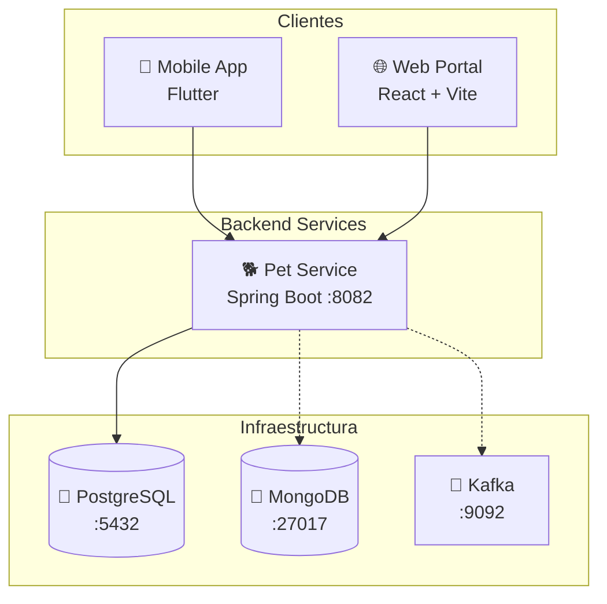
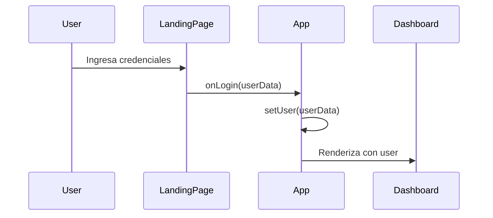

# PetAuthority - Documentación Técnica 🐾

## Índice
1. [Visión General](#visión-general)
2. [Arquitectura del Sistema](#arquitectura-del-sistema)
3. [Backend - Pet Service](#backend---pet-service)
4. [Aplicación Móvil - Flutter](#aplicación-móvil---flutter)
5. [Portal Web - React](#portal-web---react)
6. [Infraestructura y Base de Datos](#infraestructura-y-base-de-datos)
7. [API Reference](#api-reference)
8. [Guía de Desarrollo](#guía-de-desarrollo)

---

## Visión General

**PetAuthority** es una plataforma premium de gestión de mascotas compuesta por tres componentes principales:

| Componente | Tecnología | Puerto | Descripción |
|------------|------------|--------|-------------|
| **Backend** | Spring Boot (Java 17) | 8082 | API REST para gestión de mascotas y registros médicos |
| **Mobile App** | Flutter 3.10+ | N/A | App móvil con estética "Liquid Glass" |
| **Web Portal** | React + Vite | 5173 | Dashboard para veterinarios |

---

## Arquitectura del Sistema



### Flujo de Datos

1. **Mobile → Backend**: La app Flutter realiza peticiones HTTP a `http://{IP}:8082/pets`
2. **Web → Backend**: El portal React usa Axios para conectarse a `http://localhost:8082`
3. **Backend → PostgreSQL**: Persistencia de datos relacionales (mascotas, vacunas, registros médicos)

---

## Backend - Pet Service

### Ubicación
```
backend/pet-service/
```

### Estructura del Proyecto

```
backend/pet-service/
├── src/main/java/com/petauthority/
│   ├── PetServiceApplication.java     # Punto de entrada
│   ├── pet/
│   │   ├── Pet.java                   # Entidad JPA
│   │   ├── PetController.java         # REST Controller
│   │   └── PetRepository.java         # JPA Repository
│   └── medical/
│       ├── MedicalRecord.java         # Entidad de registros médicos
│       ├── Vaccine.java               # Entidad de vacunas
│       └── MedicalController.java     # REST Controller
└── src/main/resources/
    └── application.yml                # Configuración
```

### Entidades del Dominio

#### Pet (Mascota)
| Campo | Tipo | Descripción |
|-------|------|-------------|
| `id` | Long | ID auto-generado |
| `name` | String | Nombre de la mascota |
| `species` | String | Especie (Dog, Cat, etc.) |
| `breed` | String | Raza |
| `birthDate` | LocalDate | Fecha de nacimiento (yyyy-MM-dd) |
| `ownerId` | Long | ID del dueño |

#### MedicalRecord (Registro Médico)
| Campo | Tipo | Descripción |
|-------|------|-------------|
| `id` | Long | ID auto-generado |
| `petId` | Long | Referencia a la mascota |
| `date` | LocalDate | Fecha del registro |
| `description` | String | Descripción del procedimiento |
| `vetName` | String | Nombre del veterinario |
| `notes` | String | Notas adicionales |

#### Vaccine (Vacuna)
| Campo | Tipo | Descripción |
|-------|------|-------------|
| `id` | Long | ID auto-generado |
| `petId` | Long | Referencia a la mascota |
| `vaccineName` | String | Nombre de la vacuna |
| `administeredDate` | LocalDate | Fecha de aplicación |
| `nextDueDate` | LocalDate | Próxima fecha de vacunación |
| `vetSignature` | String | Firma del veterinario |

### Configuración (`application.yml`)

```yaml
server:
  port: 8082

spring:
  datasource:
    url: jdbc:postgresql://localhost:5432/petauthority_db
    username: petadmin
    password: petpassword
  jpa:
    hibernate:
      ddl-auto: update  # Auto-crea tablas
```

### Cómo Ejecutar

```bash
cd backend/pet-service
mvn spring-boot:run
```

---

## Aplicación Móvil - Flutter

### Ubicación
```
mobile/
```

### Estructura del Proyecto

```
mobile/lib/
├── main.dart                    # Punto de entrada
├── theme.dart                   # Sistema de diseño "Liquid Glass"
├── models/
│   └── pet.dart                 # Modelo de datos Pet
├── screens/
│   ├── login_screen.dart        # Pantalla de login
│   ├── home_screen.dart         # Pantalla principal con lista de mascotas
│   ├── add_pet_screen.dart      # Formulario para agregar mascota
│   ├── pet_detail_screen.dart   # Detalles de mascota
│   └── services_screen.dart     # Servicios disponibles
├── services/
│   └── api_service.dart         # Cliente HTTP para el backend
└── widgets/
    └── glass_container.dart     # Widget de glassmorphism
```

### Sistema de Diseño (theme.dart)

#### Paleta de Colores
| Color | Hex | Uso |
|-------|-----|-----|
| `primaryColor` | `#6C63FF` | Botones, acentos principales |
| `secondaryColor` | `#03DAC6` | Acentos secundarios (teal) |
| `backgroundColor` | `#1E1E2C` | Fondo principal |
| `surfaceColor` | `#2D2D44` | Superficies elevadas |
| `errorColor` | `#CF6679` | Estados de error |

#### Tipografía
- **Fuente principal**: Google Fonts - Outfit
- **Display Large**: 32px, Bold
- **Display Medium**: 28px, Semi-Bold
- **Body Large**: 16px
- **Body Medium**: 14px

### API Service (api_service.dart)

```dart
class ApiService {
  // Configuración de URL por plataforma
  static String get baseUrl {
    if (Platform.isAndroid) {
      // Emulador: 10.0.2.2
      // Dispositivo físico: IP de la máquina
      return 'http://172.31.12.73:8082/pets';
    }
    return 'http://localhost:8082/pets';
  }

  Future<List<Pet>> getPets() async { ... }
  Future<Pet> createPet(Pet pet) async { ... }
}
```

> [!IMPORTANT]
> **Dispositivos físicos Android**: Debes actualizar `_localMachineIP` en `api_service.dart` con la IP de tu Mac. El dispositivo debe estar en la misma red WiFi.

### Pantallas Principales

| Pantalla | Archivo | Descripción |
|----------|---------|-------------|
| Login | `login_screen.dart` | Autenticación de usuario |
| Home | `home_screen.dart` | Carrusel de mascotas + acciones rápidas |
| Add Pet | `add_pet_screen.dart` | Formulario de registro de mascota |
| Pet Detail | `pet_detail_screen.dart` | Información detallada de mascota |
| Services | `services_screen.dart` | Marketplace de servicios |

### Cómo Ejecutar

```bash
cd mobile
flutter pub get
flutter run
```

---

## Portal Web - React

### Ubicación
```
web_portal/
```

### Estructura del Proyecto

```
web_portal/src/
├── main.jsx                    # Punto de entrada
├── App.jsx                     # Componente principal con routing
├── App.css                     # Estilos globales
├── index.css                   # Reset y variables CSS
├── components/
│   ├── LandingPage.jsx         # Página de login/registro
│   ├── Sidebar.jsx             # Navegación lateral
│   ├── Dashboard.jsx           # Panel principal con estadísticas
│   ├── Patients.jsx            # Gestión de pacientes (mascotas)
│   └── PetList.jsx             # Lista de mascotas
└── services/
    └── api.js                  # Cliente Axios
```

### Flujo de Autenticación



### Componentes Principales

| Componente | Responsabilidad |
|------------|-----------------|
| `App.jsx` | Router y estado de autenticación |
| `LandingPage.jsx` | Login y registro de veterinarios |
| `Sidebar.jsx` | Navegación entre secciones |
| `Dashboard.jsx` | Estadísticas y resumen |
| `Patients.jsx` | CRUD de mascotas/pacientes |

### API Service (api.js)

```javascript
import axios from 'axios';

const api = axios.create({
    baseURL: 'http://localhost:8082',
    headers: {
        'Content-Type': 'application/json',
    },
});

export default api;
```

### Cómo Ejecutar

```bash
cd web_portal
npm install
npm run dev
```

Abre `http://localhost:5173` en el navegador.

---

## Infraestructura y Base de Datos

### Docker Compose

El archivo `docker-compose.yml` define la infraestructura:

| Servicio | Imagen | Puerto | Uso |
|----------|--------|--------|-----|
| PostgreSQL | `postgres:15-alpine` | 5432 | Base de datos principal |
| MongoDB | `mongo:6.0` | 27017 | Datos de telemetría GPS |
| Zookeeper | `confluentinc/cp-zookeeper:7.3.0` | 2181 | Coordinador Kafka |
| Kafka | `confluentinc/cp-kafka:7.3.0` | 9092 | Mensajería en tiempo real |

### Credenciales de Base de Datos

| Base de Datos | Usuario | Contraseña | Base |
|---------------|---------|------------|------|
| PostgreSQL | `petadmin` | `petpassword` | `petauthority_db` |
| MongoDB | `petadmin` | `petpassword` | - |

### Cómo Iniciar Infraestructura

```bash
docker-compose up -d
```

### Esquema de Base de Datos (PostgreSQL)

```mermaid
erDiagram
    PETS {
        bigint id PK
        varchar name
        varchar species
        varchar breed
        date birth_date
        bigint owner_id
    }
    
    MEDICAL_RECORDS {
        bigint id PK
        bigint pet_id FK
        date date
        varchar description
        varchar vet_name
        text notes
    }
    
    VACCINES {
        bigint id PK
        bigint pet_id FK
        varchar vaccine_name
        date administered_date
        date next_due_date
        varchar vet_signature
    }
    
    PETS ||--o{ MEDICAL_RECORDS : "tiene"
    PETS ||--o{ VACCINES : "recibe"
```



---

## API Reference

### Pets API

| Método | Endpoint | Descripción |
|--------|----------|-------------|
| `GET` | `/pets` | Obtener todas las mascotas |
| `POST` | `/pets` | Crear nueva mascota |
| `GET` | `/pets/{id}` | Obtener mascota por ID |
| `GET` | `/pets/owner/{ownerId}` | Mascotas por dueño |

#### Ejemplo: Crear Mascota

```bash
curl -X POST http://localhost:8082/pets \
  -H "Content-Type: application/json" \
  -d '{
    "name": "Luna",
    "species": "Dog",
    "breed": "Golden Retriever",
    "birthDate": "2023-05-15",
    "ownerId": 1
  }'
```

### Medical API

| Método | Endpoint | Descripción |
|--------|----------|-------------|
| `GET` | `/api/medical/records/{petId}` | Registros médicos de mascota |
| `GET` | `/api/medical/vaccines/{petId}` | Vacunas de mascota |

---

## Guía de Desarrollo

### Prerrequisitos

- **Docker Desktop** - Para bases de datos
- **Java 17 JDK** - Para backend
- **Node.js 18+** - Para web portal
- **Flutter SDK 3.10+** - Para app móvil

### Orden de Inicio

1. **Infraestructura**
   ```bash
   docker-compose up -d
   ```

2. **Backend**
   ```bash
   cd backend/pet-service && mvn spring-boot:run
   ```

3. **Web Portal**
   ```bash
   cd web_portal && npm run dev
   ```

4. **Mobile**
   ```bash
   cd mobile && flutter run
   ```

### Solución de Problemas Comunes

#### Mobile: "Connection timed out" en dispositivo físico

1. Asegúrate que el dispositivo esté en la **misma red WiFi** que tu Mac
2. Obtén la IP de tu Mac: `ipconfig getifaddr en0`
3. Actualiza `_localMachineIP` en `mobile/lib/services/api_service.dart`
4. Desactiva el firewall de macOS temporalmente

#### Web: Error HTTPS en Safari

Usa Chrome/Firefox o accede via `http://127.0.0.1:5173`

#### Backend: No conecta a PostgreSQL

Verifica que Docker esté corriendo:
```bash
docker ps | grep postgres
```

---

## Estructura de Carpetas Completa

```
arquitectura/
├── docker-compose.yml          # Infraestructura
├── README.md                   # Guía rápida
├── documentacion.md            # Este archivo
│
├── backend/
│   ├── pom.xml                 # Configuración Maven
│   ├── api-gateway/            # (Futuro) API Gateway
│   ├── auth-service/           # (Futuro) Autenticación
│   ├── tracking-service/       # (Futuro) GPS Tracking
│   └── pet-service/            # ✅ Servicio principal
│
├── mobile/
│   ├── pubspec.yaml            # Dependencias Flutter
│   ├── lib/                    # Código fuente Dart
│   ├── android/                # Configuración Android
│   └── ios/                    # Configuración iOS
│
└── web_portal/
    ├── package.json            # Dependencias npm
    ├── vite.config.js          # Configuración Vite
    └── src/                    # Código fuente React
```

---

*Última actualización: Enero 2026*
*PetAuthority - Tu mejor amigo para cuidar mascotas* 🐾
